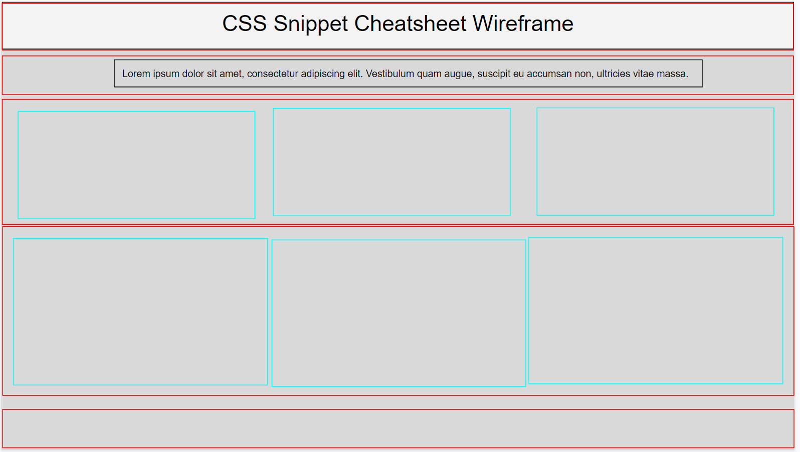

# Activity 2: Wireframing Unsolved

* The rows are highlighted in red and the columns are highlighted in blue.

© 2022 Trilogy Education Services, LLC, a 2U, Inc. brand. Confidential and Proprietary. All Rights Reserved.